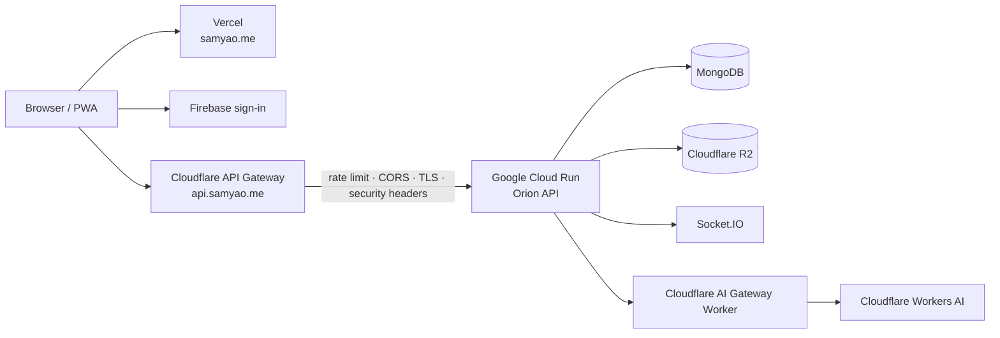

# Orion

**Navigate your value.**

Orion is Sam Yao's bilingual digital garden and personal operating system. It brings a public journal, engineering portfolio and live app directory together with a private **Captain's Cabin** for writing, personal data, health, travel and AI-assisted workflows.

[Live site](https://samyao.me) · [中文说明](README_CN.md)


## What is implemented

- **Public journal:** searchable posts, tags, comments, reactions, rich media and responsive article reading.
- **Writing studio:** Tiptap rich text, headings, blockquotes, typography and colour controls, tables, tasks, code, syntax-safe LaTeX paste, emoji, online GIF search, video embeds, vector handwriting and direct clipboard image upload to R2.
- **Consistent reading:** the editor, live preview and published article share the same content renderer, with violet-on-white and gold-on-cosmic theme palettes.
- **Portfolio:** an Apps-first Web / Full Stack / Mobile directory with live demos and source links; professional experience lives at the secondary /profile/experience route, without CV download controls.
- **Captain's Cabin:** JWT/RBAC-protected journal, second brain, to-do systems, fitness records, photo gallery, footprint map, personal utilities and account-aware private data.
- **AI and realtime tools:** context-aware assistants, streaming responses and Socket.IO chat backed by the companion API.
- **Installable web app:** responsive desktop, tablet and mobile layouts with PWA metadata and service-worker caching.
- **Bilingual interface:** English and Chinese content, navigation and portfolio presentation.

## Journal experience

The journal is designed as one writing system rather than separate editor and reader implementations.

- Paste display math such as `$$P(\text{mW}) = 10^{\frac{\text{dBm}}{10}}$$` and keep its fraction and exponent structure.
- Paste an image directly into the editor; Orion reuses the authenticated upload path and stores the returned R2 URL.
- Apply fonts, sizes and colours to selected text, insert emoji or GIFs, embed supported video links and draw editable SVG handwriting.
- Preserve legacy Quill HTML, code containing dollar delimiters, tables, task lists and existing journal entries.
- Keep private and public drafts isolated by account, and prevent publishing while media is still uploading.

## Local development

Requirements: Node.js 22+ and pnpm 9+.

```bash
git clone https://github.com/yaohuangguan/orion-frontend.git
cd orion-frontend
pnpm install
pnpm dev:local
```

`pnpm dev:local` expects the API at `http://localhost:5000/api`. Use `pnpm dev` when `VITE_API_URL` is already configured or when you want the production API fallback.

Create `.env` for environment-specific values:

```dotenv
VITE_API_URL=http://localhost:5000/api
VITE_FIREBASE_API_KEY=...
VITE_FIREBASE_AUTH_DOMAIN=...
VITE_FIREBASE_PROJECT_ID=...
VITE_FIREBASE_STORAGE_BUCKET=...
VITE_FIREBASE_MESSAGING_SENDER_ID=...
VITE_FIREBASE_APP_ID=...
```

Do not commit real credentials. Firebase mock values keep unauthenticated local pages usable, while private features require the API and a valid account.

## Quality checks

```bash
pnpm typecheck
pnpm lint
pnpm test
pnpm build
```

The browser suite covers LaTeX paste, code preservation, image upload and failure recovery, handwriting undo/redo and serialization, rich typography, emoji and GIF insertion, video round trips, draft isolation, legacy content, mobile overflow and both Orion themes.

## Architecture

Production separates the public frontend from the protected API origin. The browser never needs the
Cloud Run hostname: all production API and realtime traffic uses `https://api.samyao.me`.



### Production API edge

`api.samyao.me` is a Cloudflare Worker custom domain in front of Cloud Run.

- Cloudflare terminates TLS, applies per-IP rate limits, handles CORS preflight and adds security headers before requests reach the application.
- The Worker injects a private `x-orion-edge-secret`; Cloud Run rejects direct `/api/*` requests that do not carry the matching server-side secret. The public `run.app` hostname therefore cannot execute normal API business logic directly.
- Cloud Run keeps `minScale=0` and `maxScale=2` as an additional cost/surge guardrail.
- Mutable portfolio, journal and homepage API responses are deliberately returned with `Cache-Control: no-store`. New or edited projects/posts must be visible immediately after a successful write; edge caching is reserved for data with an explicit staleness contract.
- Authenticated/BYOK secrets stay out of URLs and browser persistence. Optional Cloudflare AI credentials are session-only and are forwarded only for the current request.

### GitHub → Apps import

Portfolio import uses a streaming POST endpoint instead of waiting for one long JSON response.

```text
GitHub URL
  → validate repository
  → fetch metadata
  → read README / package.json
  → Cloudflare Workers AI analysis
  → bilingual portfolio draft
  → deterministic Orion cover
  → review in Project editor
  → Save Project
```

The backend emits Server-Sent Event formatted progress frames over the POST response, including
heartbeats while Workers AI is running. The React client reads the response stream with `fetch()`
and updates the progress UI in real time. Preview generation does not write MongoDB or upload R2
assets; persistence still happens only when **Save Project** is pressed.

```text
components/             shared UI, journal editor/reader, profile and private widgets
pages/                  public routes and Captain's Cabin workspaces
services/               API, authentication, content and media clients
i18n/                   English and Chinese locale data
constants/              navigation and built-in app catalogue
tests/journal/           browser-level editor and renderer regression suite
public/                  PWA, SEO and project assets
```

React 19 · TypeScript · Vite · Tailwind CSS · Tiptap · KaTeX · Firebase · Socket.IO · Recharts · ECharts · Leaflet · Puppeteer.

## Data and security

- Public posts and portfolio data are readable without a session; private routes are enforced by backend permissions.
- Authentication tokens and private entries are handled by the API. The frontend does not embed server secrets.
- Pasted HTML is sanitised before rendering. Unsafe links and untrusted video embeds are rejected.
- Media upload state blocks premature publishing and stores durable remote URLs instead of local blob URLs.
- The application contains personal modules. Use your own environment, database and storage accounts for a separate deployment.

## Companion service

The frontend is backed by [new-bananaboom-api-2025](https://github.com/yaohuangguan/new-bananaboom-api-2025), which provides authentication, permissions, content, uploads, realtime events and personal-data APIs.

Contributions and issue reports are welcome. Run the quality checks before opening a pull request, and never include private journal content, exported account data or real credentials.
