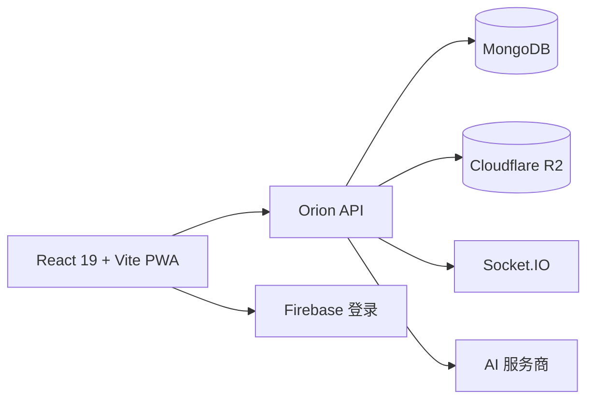

# Orion

**Navigate your value. 探索你的价值坐标。**

Orion 是 Sam Yao 的双语数字花园与个人操作系统。它把公开日志、工程作品集和应用目录，与私密的 **Captain's Cabin（舰长室）** 连接在一起，用于写作、个人数据、健康、足迹和 AI 辅助工作流。

[访问 Orion](https://samyao.me) · [English README](README.md)


## 已实现

- **公开日志：** 文章搜索、标签、评论、互动、富媒体和响应式阅读页面。
- **写作工作台：** 基于 Tiptap 的富文本、标题、引用、字体/字号/颜色、表格、任务、代码、数学公式粘贴、表情、在线 GIF 搜索、视频嵌入、SVG 手写和粘贴图片自动上传 R2。
- **编辑与阅读一致：** 编辑器、实时预览和公开文章共用同一套内容协议；亮色采用白紫色，暗色采用宇宙黑与金色。
- **作品与简历：** 默认展示 Apps，支持 Web / Full Stack / Mobile 分类、在线体验与源码；职业经历放在二级路由 /profile/experience，不提供 CV 下载入口。
- **舰长室：** 由 JWT 与 RBAC 保护的私密日志、第二大脑、待办、健身、照片墙、足迹和个人工具。
- **AI 与实时能力：** 上下文助手、流式响应和基于 Socket.IO 的聊天，由配套 API 提供服务。
- **PWA：** 桌面、平板和手机响应式布局，包含安装信息和 Service Worker 缓存。
- **中英双语：** 导航、内容和作品集均支持中英文显示。

## Journal 写作体验

Journal 不是编辑器和展示页的两套实现，而是一套贯通写作、预览和发布的内容系统。

- 可直接粘贴 `$$P(\text{mW}) = 10^{\frac{\text{dBm}}{10}}$$`，保留分数与指数结构。
- 可直接粘贴图片，复用 Orion 已有鉴权上传流程并保存 R2 返回地址。
- 可修改选中文字的字体、字号和颜色，插入表情与网络 GIF，嵌入视频并绘制可继续编辑的 SVG 手写笔迹。
- 兼容旧 Quill HTML、含美元符号的代码、表格、任务清单和已有日志。
- 草稿按用户及公开/私密状态隔离；图片尚未上传完成时不会误发布。

## 本地开发

需要 Node.js 22+ 与 pnpm 9+。

```bash
git clone https://github.com/yaohuangguan/orion-frontend.git
cd orion-frontend
pnpm install
pnpm dev:local
```

`pnpm dev:local` 默认连接 `http://localhost:5000/api`。如果已配置 `VITE_API_URL`，或需要使用生产 API 回退地址，可运行 `pnpm dev`。

在根目录创建 `.env`：

```dotenv
VITE_API_URL=http://localhost:5000/api
VITE_FIREBASE_API_KEY=...
VITE_FIREBASE_AUTH_DOMAIN=...
VITE_FIREBASE_PROJECT_ID=...
VITE_FIREBASE_STORAGE_BUCKET=...
VITE_FIREBASE_MESSAGING_SENDER_ID=...
VITE_FIREBASE_APP_ID=...
```

不要提交真实凭据。Firebase 模拟配置可以支持公开页面的本地开发，私密功能仍需要 API 与有效账户。

## 质量验证

```bash
pnpm typecheck
pnpm lint
pnpm test
pnpm build
```

浏览器测试覆盖公式粘贴、代码保真、图片上传与失败恢复、手写撤销/重做及序列化、字体样式、表情和 GIF、视频往返、草稿隔离、旧内容兼容、手机横向溢出和 Orion 两套主题。

## 技术结构



```text
components/             通用 UI、Journal 编辑/阅读、Profile 与私密组件
pages/                  公开页面与 Captain's Cabin 工作区
services/               API、鉴权、内容与媒体客户端
i18n/                   中英文文案
constants/              导航与内置应用目录
tests/journal/           编辑器和阅读器浏览器回归测试
public/                  PWA、SEO 和项目资源
```

React 19 · TypeScript · Vite · Tailwind CSS · Tiptap · KaTeX · Firebase · Socket.IO · Recharts · ECharts · Leaflet · Puppeteer。

## 数据与安全

- 公开文章和作品数据允许游客读取；私密路由由后端权限系统执行。
- 登录令牌与私密内容交由 API 处理，前端不包含服务端密钥。
- 粘贴 HTML 在展示前会清理；危险链接和不受信任的视频嵌入会被拒绝。
- 媒体上传期间阻止过早发布，最终内容保存远程地址，不保存临时 Blob URL。
- 项目包含个人数据模块。独立部署时请使用自己的数据库、存储和环境配置。

## 配套后端

前端使用 [new-bananaboom-api-2025](https://github.com/yaohuangguan/new-bananaboom-api-2025) 提供鉴权、权限、内容、上传、实时事件和个人数据 API。

欢迎提交 issue 或 pull request。提交前请运行完整检查，不要加入私人日志、账户导出数据或真实凭据。
